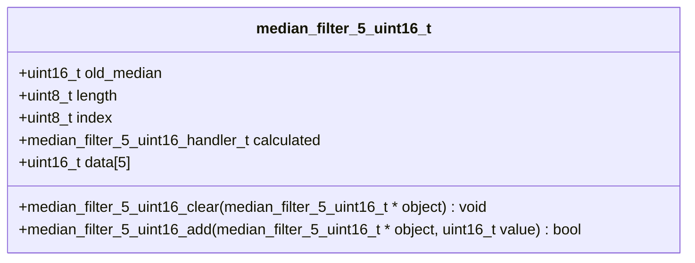

# lib-c-median

The median filter is object-oriented and designed to be called with each new
measured value. For this purpose, the function `median_filter_<N>_<TYPE>_add()`
is called. Sorting is carried out with each call, so the calculation effort
is distributed over the individual steps. Together with the fixed size, the
sorting is carried out very efficiently. If all values are available, the
handler is called in the stored function pointer `calculated`. After the
handler has been called in the add function, this function is exited with
the return value `true`. Within the handler, the old median value can be
accessed using `old_median`. Furthermore, all values are available in sorted
form in the array `data`. The code thus immediately implements a ranking
filter with the corresponding minimum and maximum values.



The filter can be used as follows:

```c
uint16_t min, median, max;

median_filter_5_uint16_t median5 = MEDIAN_FILTER_5_UINT16_INIT();

uint16_t input_data[] = { 2, 1, 4, 1, 3 };

for(uint8_t i = 0; i < 5; i++)
{
    if(median_filter_5_uint16_add(&median5, input_data[i]))
    {
        min = median5.data[0]; // is 1
        median = median5.old_median; // is 2
        max = median5.data[4]; // is 4
    }
}
```
