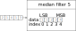

# lib-c-median

This library implements an object-oriented ranking filter. This is a non-linear filter that sorts measured values according to their value and returns one value. For example, the median 5 filter only returns a filtered value after 5 measured values. This is important when selecting the sampling frequency. In accordance with the principles of signal theory, oversampling must be used. Since the filter allows the effective sampling frequency to be calculated by dividing the sampling frequency by the rank of the filter. Thus, the effective sampling frequency of a median 5 filter is only one fifth of the actual sampling frequency.

<picture>
  <source
    media="(prefers-color-scheme: dark)"
    srcset="./docs/median_filter_5_dark.svg" />
  
</picture>

## Example

The median filter is designed to be called with each new measured value. For this purpose, the function `median_filter_5_uint16.Add()` is called. Sorting is carried out with each call, so the calculation effort is distributed over the individual steps. Together with the fixed size, the sorting is carried out very efficiently. If all values are available, the handler is called in the stored function pointer `on_calculated`. After the handler has been called in the add function, this function is exited with the return value `true`. Furthermore, all values are available in sorted form in the array `data`. This means that not only the median value can be used, but also the corresponding minimum and maximum values.

```c
uint16_t min, median, max;

median_filter_5_uint16_t median5 = MEDIAN_FILTER_5_UINT16_INIT();

uint16_t input_data[] = { 2, 1, 4, 1, 3 };

for(uint8_t i = 0; i < 5; i++)
{
    if(median_filter_5_uint16.Add(&median5, input_data[i]))
    {
        min = median_filter_5_uint16.Min(&median5); // is 1
        median = median_filter_5_uint16.Median(&median5); // is 2
        max = median_filter_5_uint16.Max(&median5); // is 4
    }
}
```
